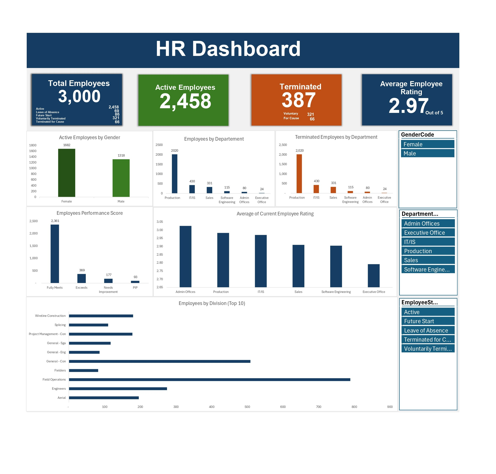

# HR Analytics Dashboard

## Overview

This project is an interactive HR Analytics Dashboard built in Microsoft Excel to analyze employee data and support HR decision-making.

## Dashboard Preview

## Dataset

The dataset used in this project was obtained from Kaggle.

## Tools Used

- Microsoft Excel
- Power Query
- Pivot Tables
- Excel Formulas
- Interactive Dashboard

## Key Metrics

- Total Employees
- Active Employees
- Terminated Employees
- Average Employee Rating
- Department Analysis
- Performance Score Analysis

## Skills Demonstrated

- Data Cleaning
- Data Transformation
- Data Analysis
- KPI Reporting
- Dashboard Design
- Data Visualization

## Files

- HR_Analytics_Dashboard.xlsx
- HR-Analytics-Dashboard.jpg
